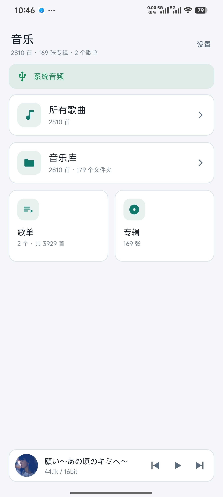
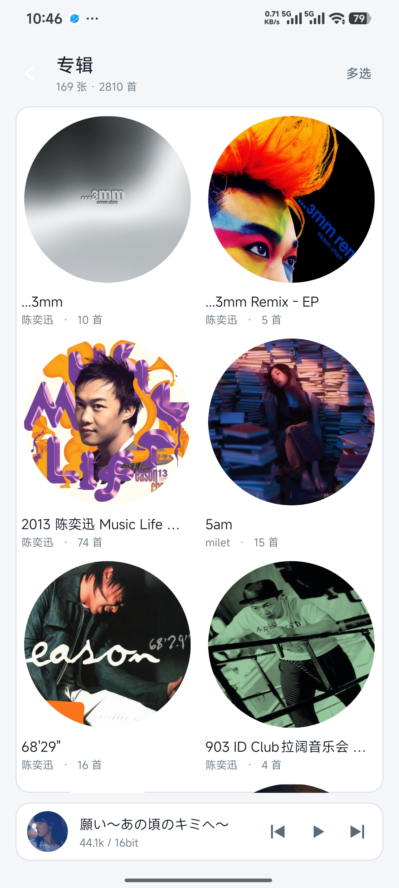
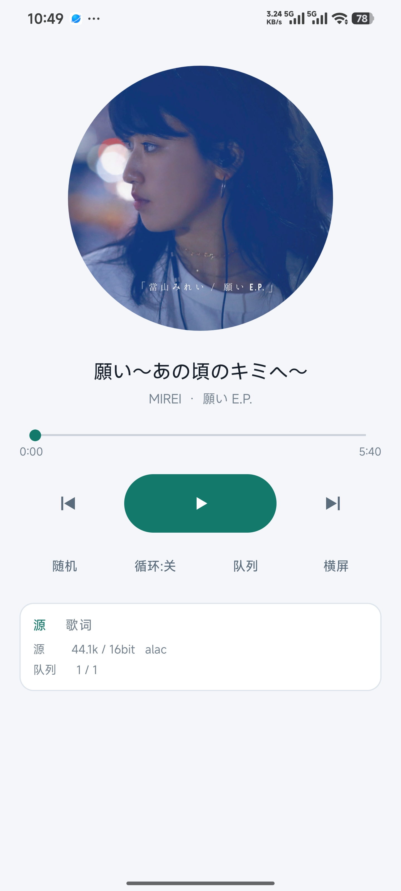
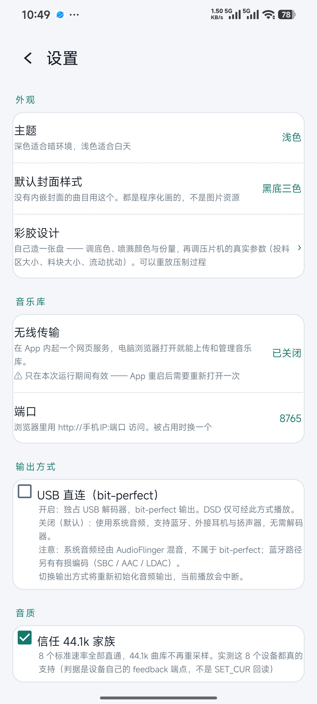

<p align="center">
  
</p>

<h1 align="center">yuHIFI</h1>

<p align="center"><strong>Android 平台的 bit-perfect USB 音频播放器。</strong><br>
自研 UAC 驱动与 libusb 独占输出，绕过系统音频栈，将解码后的字节直接送入 USB 解码器。</p>

<p align="center">
  <a href="LICENSE.md"></a>
  <a href="#下载与安装"></a>
  <a href="#下载与安装"></a>
  <a href="#架构"></a>
  <a href="#架构"></a>
</p>

> **本项目采用 PolyForm Noncommercial 1.0.0 许可。** 个人使用、学习、研究与非营利组织使用免费；商业用途须另行取得授权。详见[许可](#许可)一节。

## 简介

多数 Android 音乐应用的音频需经 `AudioFlinger` 混音。对于外接 USB 解码器的用户，这意味着送入 DAC 的已非文件中的原始数据。
- 测试设备：MOONDROP Dawn Pro（2FC6:F06A）、TANCHJIM BUNNY DSP

yuHIFI 采用另一条路径：

- 以 **libusb 直接接管 USB 音频接口**，通过 isochronous 传输把 PCM 交给解码器
- 播放过程中**不重采样、不混音、不做音量衰减**（可选功能默认全部关闭）
- 输出速率**跟随源文件**：44.1kHz 输出 44.1kHz，176.4kHz 输出 176.4kHz

数据通路：

```
FFmpeg 解码 ──▶ [重采样] ──▶ [交叉馈送] ──▶ [软件音量] ──▶ 环形缓冲 ──▶ USB 解码器
              仅非标准速率    可选            可选
```

方括号内的三个阶段默认全部关闭；关闭时处理链不接触任何样本。

## 特性

### bit-perfect 输出

- **自研 UAC 驱动**：自行解析描述符、发送 `SET_CUR`、跟随异步解码器的 feedback 端点
- **字节级验证**：将实际交给 USB 的字节转储后与 ffmpeg 解出的参考逐字节比对，176.4kHz/24bit 下 102 万个帧完全一致
- **不信任设备自报的能力**：测试设备对任何采样率均回答"接受"，实际仅支持 8 个标准速率。因此能力表由实测得出，而非读取描述符

### 格式支持

除 DSD 外全部由 FFmpeg 解码；**DSD 使用自研解析器**（`dsf` / `dff` 原生位流直通）。FFmpeg 的 `dsd2pcm` 输出的是有损 PCM，而原生 DSD 需要裸位流。

| 后缀 | | 后缀 | |
|---|---|---|---|
| `flac` `alac` `m4a` | ✅ | `wav` `aif` `aiff` | ✅ |
| `mp3` `aac` | ✅ | `ape` `wv` | ✅ |
| `ogg` `opus` `oga` | ✅ | **`wma`** | ✅ |
| **`dsf` `dff`** | ✅ 原生 DSD | `mka` | ⚠️ 取决于封装内容 |
| `ac3` `dts` `mpc` `tak` `tta` | ❌ | | |

判据与重建方法见[音频格式支持](docs/08-音频格式支持.md)。

### 音量

独占模式绕过系统音频栈，因此**系统音量键对其无效**；而多数 USB 解码器的 UAC 硬件音量并未实现。本应用提供三层方案：

- **软件音量** —— 内部格式将源样本左对齐到 32 位，低 16 位为空。开启后输出位深提升至 24bit，衰减消耗的是这 8 位空位，**−48dB 以内不损失有效位**
- **音量上下限** —— 为滑条两端设定边界，防止误操作
- **音量锁** —— 设定后锁定滑条，防误触；设置页与播放页同步，重启后仍生效

### 交叉馈送

佩戴耳机时将左右声道互相渗入，缓解声像集中于头部的疲劳感。三档强度（延迟 0.20 / 0.35 / 0.50 ms，交叉量 −6 / −4.5 / −3 dB），并做归一化处理以杜绝削顶。

### 音乐库

- 目录树浏览与拼音首字母索引（使用系统 `Transliterator`，不内置字表）
- 专辑、歌单、播放队列三者独立
- 彩胶封面：按真实压片工艺模拟生成
- 歌词页，逐行同步滚动

### 无线传输

应用内启动 HTTP 服务，浏览器访问 `http://<手机IP>:8765` 即可上传文件。另提供图形界面上传工具（纯 Tkinter，无需 pip）与命令行版本，适用于大批量传输；两者均在上传前逐个试读，并列出无法读取的文件及原因。

**该开关默认关闭**（HTTP 端口无鉴权）。

## 截图

<!-- 四张图位于 docs/images/，文件名须一致。实测尺寸 1440×3200。 -->

| 首页 | 音乐库 |
|---|---|
|  |  |

| 正在播放 | 设置 |
|---|---|
|  |  |

## 下载与安装

从 [**Releases**](../../releases) 页面下载最新 APK，传输至手机后安装（需允许「安装未知来源应用」）。

| | |
|---|---|
| 系统要求 | **Android 8.0（API 26）或更高** |
| 架构 | **仅 arm64-v8a** |
| 权限 | 不需要存储权限（USB 走系统弹窗，文件走 SAF）。唯一请求的是**通知**权限，用于播放期间的常驻通知；**拒绝该权限不影响任何功能** |

> 安装前请确认版本号。应用启动后的首行日志与导出的报告头部均标明版本号与 versionCode，其中**安装时间**是区分同版本号不同构建的唯一字段。

## 两种输出方式

应用内提供两条并行通路，**默认使用系统音频**：

| | 系统音频（默认） | USB 直连 |
|---|---|---|
| 实现 | AAudio | libusb isochronous |
| bit-perfect | ❌ 经 AudioFlinger 混音 | ✅ |
| DSD | ❌ **明确拒绝** | ✅ 唯一可播放 DSD 的通路 |
| 音量键 | 有效 | 无效（需使用应用内的软件音量） |

两条通路消费同一数据源，切换时遵循「先拆再建」——从直连切换至系统音频会先完整释放 USB 接口。

> **解码器被其他应用占用独占接口时**，首页状态条提供「重新连接」按钮，执行一次硬重连（含 `libusb_reset_device`）。部分带 DSP 的解码器，其配套调音软件运行于手机时会占用该接口。

## 架构

```
┌─ 解码线程 ────────────────────────────────────────────────┐
│  FFmpeg 解码 → 重采样(可选) → 交叉馈送(可选) → 软件音量(可选) │
│                          → 转线格式 → 2MB 环形缓冲          │
└───────────────────────────────────────────────────────────┘
                              │  单生产者单消费者无锁环
┌─ 输出端 ──────────────────┴───────────────────────────────┐
│  IsoPlayer（libusb，32 个 URB 在途）  或  SystemAudioSink   │
└───────────────────────────────────────────────────────────┘
```

三条必须遵守的约束：

1. **USB 提交线程不得进行文件 I/O，亦不得进行内存重分配。** 两者都是不可控的长阻塞；后者曾导致转储缓冲每次扩容即卡死，且卡顿时刻精确翻倍（4.1 / 8.3 / 16.6 秒）才暴露其规律。
2. **libusb 事件处理仅在 iso 线程上。** 回调中只能置标志；调用 `stop()` 会造成自我 join。
3. **包长按样本数做 Bresenham 小数分配，不得按字节。** 按字节对齐到帧边界会使 44.1kHz 实际运行为 40kHz。

```
app/src/main/
├── java/com/hifiprobe/
│   ├── DeviceGate.kt        设备生命周期：授权 / 打开 / 重连 / 超时
│   ├── PlayerSession.kt     播放会话（全局单份）
│   ├── PlaybackService.kt   前台服务，防冻结
│   ├── WirelessServer.kt    8765 端口的上传服务
│   ├── UacParser.kt         UAC1/UAC2 描述符解析
│   └── Settings.kt          全部设置项与音量计算
└── cpp/
    ├── iso_player.cpp       isochronous 引擎（包长、URB 调度、feedback 跟随）
    ├── audio_engine.cpp     解码 / 重采样 / 缓冲编排
    ├── dsd_reader.cpp       自研 DSF/DFF 原生位流解析
    ├── ffmpeg_decoder.cpp   FFmpeg 解码，自定义 AVIOContext 走 fd
    ├── crossfeed.cpp        交叉馈送
    ├── system_audio_sink.cpp AAudio 输出
    └── ring_buffer.h        无锁环形缓冲
```

## 自行编译

需要 **NDK `27.0.12077973`** 与 **CMake `3.22.1`**。

```bash
./gradlew assembleDebug
```

仅验证 Kotlin 层（跳过 NDK 编译）：

```bash
./gradlew assembleDebug -PskipNative
```

> ⚠️ **工程路径必须为纯 ASCII。** CMake 在含中文的路径下会直接崩溃（退出码 `0xC0000409`），这是 Windows 上 NDK 工具链的已知限制。

`third_party/_ff/out/arm64-v8a/` 中的 FFmpeg 头文件与 `.so` 为构建所需，已随仓库分发。**FFmpeg 源码树不在仓库中**（8500 余个上游文件，纳入后会淹没本项目代码）；如需重新裁剪 FFmpeg，请先下载 [ffmpeg-7.1.tar.xz](https://ffmpeg.org/releases/ffmpeg-7.1.tar.xz)，再按 `third_party/_ff/rebuild_with_wma.sh` 操作。

## 已知限制

- **仅支持 arm64-v8a。** 如需 32 位支持，须先为 `armeabi-v7a` 重新编译 FFmpeg。
- **无法检测解码器上 3.5mm 耳机的插拔** —— 设备 USB 描述符中没有 jack detection 端点，主机侧收不到任何信号。这是硬件限制。
- **DSD 冷启动首次播放可能丢失 1~26 个 URB**（数毫秒），已知，暂未处理。
- **无缝切歌（gapless）尚未实现。**
- 小米 / HyperOS 的省电策略与自启动是独立于 AOSP 电池优化的另一套机制，厂商页面无公开 API。设置页的「后台无限制」读取的是 AOSP 状态并给出路径提示，**在小米设备上该状态未必准确**。

## 许可

**PolyForm Noncommercial License 1.0.0**，全文见 [LICENSE.md](LICENSE.md)。

**允许**（无需付费、无需申请）：

- 个人使用、学习、研究、试验与业余爱好
- 非商业组织使用：慈善机构、教育机构、公共研究机构、公共安全或卫生机构、环保组织、政府机构

**不允许**：任何商业用途。如需在商业产品或服务中使用，须另行取得授权。

### 第三方组件

| 组件 | 许可 | 链接方式 |
|---|---|---|
| FFmpeg 7.1 | LGPL-2.1-or-later | 动态链接，未修改上游原版 |
| libusb 1.0.27 | LGPL-2.1-or-later | 静态链接，源码随仓库分发 |
| AndroidX / Material / Kotlin | Apache-2.0 | — |

LGPL 组件的合规说明（包括静态链接 libusb 仍属合规的理由）见 [THIRD-PARTY.md](THIRD-PARTY.md)。该文件亦记录了一处早期文档的错误：重采样使用的是 FFmpeg 的 libswresample，而非 libsoxr。

## 赞助

本项目由个人在业余时间开发，不接广告、不收集数据、不设会员。若它对你有帮助，可通过下列方式支持：

**❤️ [爱发电 · 支持 yuHIFI](https://ifdian.net/a/who2233)**

赞助完全自愿，**不影响任何功能的可用性** —— 本项目没有付费版本，也不会将功能置于赞助之后。

## 致谢

- [FFmpeg](https://ffmpeg.org/) —— 解码与重采样
- [libusb](https://libusb.info/) —— USB 访问


## Star 趋势

[](https://star-history.com/#jasyu666/yuHIFI&Date)

---

<sub>开发过程中的完整排查记录（含被推翻的结论及推翻理由）见[开发日志](docs/10-开发日志.md)。</sub>
